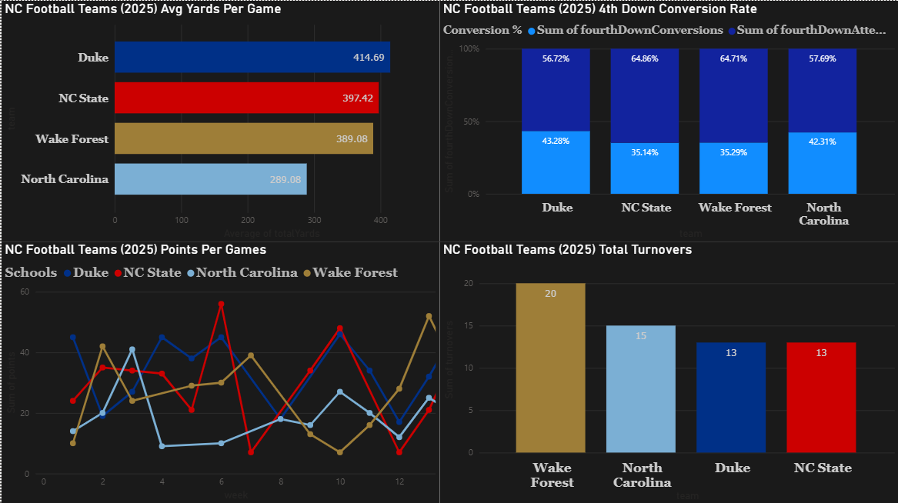

# College Football Data Analysis (NC Teams)

## Overview
This project analyzes performance trends for North Carolina FBS teams (Wake Forest, NC State, North Carolina, Duke) using data pulled from the CFBD API.

The project demonstrates a full analytics workflow including:

* Data collection (API)
* Data querying (SQL)
* Data analysis (Python, R)
* Data visualization (Power BI, Plotly)

---

## Data Source
Data was collected using the College Football Data API.

To run the API script (`api_call.ipynb`), you must provide your own API key via environment variables.

Due to size and reproducibility, a cleaned dataset is included:

* `dataset_nc_teams_2025.csv` → main dataset used for analysis
* `dataset_wake_forest_ppg.csv` → subset for visualization

---

## Power BI Dashboard

This dashboard analyzes:

* Points per game trends
* Average total yards
* Turnovers per game

---

## Points vs First Downs Analysis

This analysis examines the relationship between scoring and offensive efficiency at the game level.

### Key Finding

A moderate positive correlation (r = 0.61) was observed between first downs and points scored, suggesting that teams that sustain drives more effectively tend to generate higher scoring outputs.

---

## ANOVA: Points Per Game by Team

A one-way ANOVA test found a statistically significant difference in average points per game among North Carolina FBS teams (F = 3.13, p = 0.035).

Post-hoc analysis (Tukey HSD) revealed that North Carolina scored significantly fewer points per game than Duke, while no other pairwise differences were statistically significant.

---

## SQL Analysis

The repository includes SQL queries used for:

* Team-level performance metrics
* Situational statistics (e.g., third down efficiency)
* Game-level comparisons

File: `sql_queries.sql`

---

## Tools Used

* Python (pandas, Plotly)
* R (ANOVA, statistical testing)
* SQL (PostgreSQL)
* Power BI

---

## Notes

* API key is not included for security reasons.
* Data cleaning was performed during the API processing stage and in Python prior to analysis.
* This project focuses on clarity of analysis rather than full data engineering pipelines.

