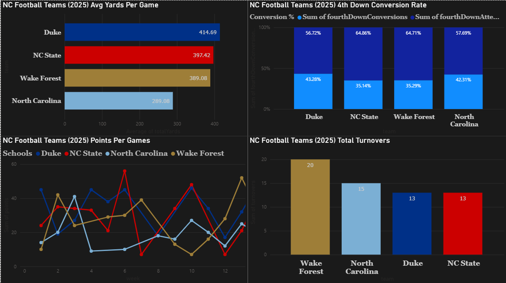

# College Football Data Analysis (NC Teams)

## Overview
This project analyzes performance trends for North Carolina FBS teams (Wake Forest, NC State, North Carolina, Duke) using data pulled from the CFBD API.

The project demonstrates a full analytics workflow including:

* Data collection (API)
* Data querying (SQL)
* Data analysis (Python, R)
* Data visualization (Power BI, Plotly)

### Project Status

This repository represents an earlier end-to-end analytics and machine learning project.
It is included to demonstrate my workflow for collecting, cleaning, querying, analyzing, visualizing, and modeling college football data.

The original data collection notebook uses the College Football Data API. 
ince this project was created, the API's authentication requirements and endpoint structure have changed.
As a result, the API extraction notebook may require updates before it can successfully retrieve new data.

I have included some cleaned datasets to be used to reproduce some statistical analyses.

---

## Data Source
Data was collected using the College Football Data API.

To run the API script (`api_call.ipynb`), you must provide your own API key via environment variables.

Due to size and reproducibility, a cleaned dataset is included:

* `dataset_nc_teams_2025.csv` → main dataset used for analysis
* `dataset_wake_forest_ppg.csv` → subset for visualization

---

## Power BI Dashboard

This dashboard analyzes:

* Points per game trends
* Average total yards
* Turnovers per game

---

## Points vs First Downs Analysis

This analysis examines the relationship between scoring and offensive efficiency at the game level.

### Key Finding

A moderate positive correlation (r = 0.61) was observed between first downs and points scored, suggesting that teams that sustain drives more effectively tend to generate higher scoring outputs.

---

## ANOVA: Points Per Game by Team

A one-way ANOVA test found a statistically significant difference in average points per game among North Carolina FBS teams (F = 3.13, p = 0.035).

Post-hoc analysis (Tukey HSD) revealed that North Carolina scored significantly fewer points per game than Duke, while no other pairwise differences were statistically significant.

---

## SQL Analysis

The repository includes SQL queries used for:

* Team-level performance metrics
* Situational statistics (e.g., third down efficiency)
* Game, team, and conference aggregations nad comparisons

File: `sql_queries.sql`

---

## Machine Learning Model

The project includes an XGBoost regression model developed to predict college football team performance using historical game and team statistics.

### Model Feature Importance:

### Model Performance without Elo

**Mean Absolute Error (MAE):** `15.45`

### Model Performance WITH Elo

**Mean Absolute Error (MAE):** `13.69`

---

## Tools Used

* Python (pandas, Plotly)
* R (ANOVA, statistical testing)
* SQL (PostgreSQL)
* Power BI
* XGBoost

---

## Notes

* API key is not included for security reasons.
* Data cleaning was performed during the API processing stage and in Python prior to analysis.
* This project focuses on clarity of analysis rather than full data engineering pipelines.

